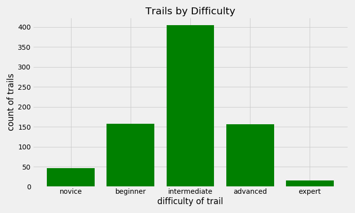
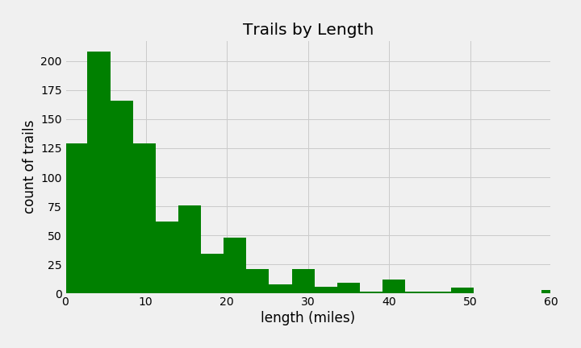
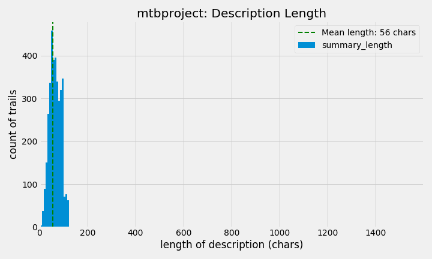

# Discovering Mountain Bike Trail Topics

### *Help me find more fast, flowy trails! Uncovering trail attributes from mountain bike trail descriptions.*

I love mountain biking.  I love riding a fast, smooth, flowy trail with great berms and a few technical sections, and when I find a trail like that I think, "Where can I find more trails like this one?!"  If only there was a way to use the trail descriptions on popular mountain biking trail apps/sites to uncover "topics", or trail attributes, that can describe the trail succintly and help users to find similar trails...

The goal of this project is to uncover latent topics in trail descriptions, i.e., find if there are underlying trail attributes like flowy, technical, scenic, etc. that show up in the description text, that can be used to describe and group trails.  Using trail descriptions from popular mtb trail websites, I used a variety of NLP and soft clustering techniques to find “topics” that can better describe the type of trail.  I then looked at the top words for each topic, as well as the top trails and their locations in each topic, to get a better sense of what the topics conveyed.

     

  
## Data

The websites <a href="https://www.mtbproject.com">mtbproject.com</a> and <a href="https://www.singletracks.com">singletracks.com</a> both have mountain biking trail
data available through their APIs, that includes the trail name, location, difficulty, star rating, length in miles, and a short summary description of the trail.  To start, I chose to use data from mtbproject since it's the site/app I'm more familiar with.  However, the trail summaries on mtbproject are very short (usually one short sentence), which I found did not yield a lot of useful information (more on that later).  So I switched to using the data from singletracks since the descriptions were several sentences/paragraphs that yielded more information for NLP and finding topics.  The "ABOUT THIS TRAIL" section is the description, and can be acccessed (along with the additional trail data fields) through the singletracks API.

 
  
I chose 10 select locations in the US that have a lot of moutain bike trails nearby, based on my previous knowledge and looking at a map of all US trails.  I also chose locations that were spread across different geographical regions in the country.

    Portland
    Denver
    Moab
    Pittsburgh
    Los Angeles
    Bellingham WA
    Boise
    Atlanta
    Little Rock
    Grand Rapids

I used the API to get data on 100 trails within a 100 mile radius of each location, to get 1000 total trails (the maximum number the API allows per day for free).
The API returns json with the following format:

To explore and model the data, I converted this into a pandas dataframe and added a column for 'length of description'.

The description field is the focus of this project, but the other fields such as trail location, difficulty, etc provide useful information for exploratory data analysis and comparing topic clusters.

## EDA

A few observations on the general features:

A look at the distribution of difficulty ratings shows that the largest portion of trails are intermediate.  

  
  
 
The majority of trails are under 10 miles long, but there are a number of longer trails including the longest trail at 140 miles (not shown on chart).

 

  
 
The average star ratings are unsuprisingly grouped around the 3-5 star range, when they have a rating (not 0).

 

 
Since I'm interested in the words in the descriptions, a general word cloud shows the most frequent words (with general stopwords removed, but before removing the 'mountain bike specific' stopwords I used for the topic modeling.)
 
 

 

## Featuratization & Modeling

### mtbproject Descriptions

As mentioned above, I first used descriptions from mtbproject.com even though the descriptions were quite short.  I used sklearn's CountVectorizer along with a custom tokenizer that used spacy lemmatization, and a custom set of stopwords that added some domain-specific stopwords to the basic English stopwords.  Added stopwords included 'singletrack', 'loop', 'trail', and 'ride', among others.

Before trying any topic modeling on the data, I ran PCA with 2 components on a TF-IDF matrix of the descriptions in order to create a 2D plot to see if there is any cluster differentiation.  This plot shows that there does seem to be some differentation in the data, and that the trail difficulty corresponds with where the descriptions fall on the two PCA components, with green and green-blue trails appearing more in the left and lower-left area, and more difficult trails appearning more in the lower right area.

 
Since I'm looking for topics, and presuppose that a trail description may contain more than one topic, I then used soft clustering approaches to uncover topics.  I trained an LDA model (using sklearn's LatentDirichletAllocation), with varying parameters.  I found the 'best' set of topics using just 3 topics, with a document-topic prior and word-topic prior of 0.9.  It seems likely that with such short descriptions, it would be difficult to find much more than 3 useful topics.

3 topics:

    Topic 0:
    ['climb' 'park' 'descent' 'fun' 'steep' 'ridge' 'fast' 'climbs' 'long'
    'scenic']
    Topic 1:
    ['great' 'road' 'creek' 'views' 'short' 'lake' 'nice' 'doubletrack'
    'access' 'connector']
    Topic 2:
    ['fun' 'technical' 'downhill' 'mountain' 'good' 'flowy' 'rock' 'fast'
    'flow' 'rocky']

    Model perplexity: 596.734

 
These make some sense; topic 0 seems to describe more difficult trails that may be steep, fast, and long.  Topic 1 seems like easier, more connector-like trails with words like 'road', 'doubletrack', 'short', and 'access'.  Topic 2 also looks like more difficult, technical trails that may be rocky.

 
I also generated topics from this data using gensim's bag-of-words vectorization and gensim LDA, using similar parameters, in order to get the topic visualization provided by gensim.  While the topics/words are not identical to sklearn's, the visualization of 3 topics does show differentiation.
 

 

 
 
Ultimately however, the short descriptions on mtbproject did not produce enough useful information for infomrative topics.  A comparison of the description length between mtbproject.com and singletracks.com shows that the singletracks descriptions contain much more information.
 
 

 

### Singletracks Descriptions

With the longer descriptions to work with using the singletracks.com data, I was able to do some more featurization and get some more topics.  First, I removed desciptions with fewer than 40 characters from my dataset, since these contain little information and included gems such as "Fun sandy areas though", and the succinct "epic".

#### Featurization:

I created a custom class and methods to featurize my descriptions.  After trying various combinations of stopwords, n-grams, and lemmatization/stemming methods, I found that the following seemed to work the best on my dataset to generate meaningful tokens for successful topic modeling.  The general process is:
- Tokenize sentences into words (removing punctuation and converting to lowercase)
- Remove the first set of stopwords, that are not be included in the bigrams and trigrams creation.  I used a modified version of the gensim STOPWORDS that took out qualifier words like 'not', 'very', 'too', 'few' that may be useful for the bigrams/trigrams (e.g., want to keep phrases like "not too steep").
- Create bigrams and trigrams using gensim Phrases and Phraser
- Lemmatize using nltk WordNetLemmatizer and nltk's part-of-speech tagging.
- Remove the second set of stopwords, including 80+ domain-specific words and bigram/trigram phrases to remove (e.g., 'parking_lot', 'mountain_bike').  

#### LDA

The next step was to create a gensim bag-of-words and try out some LDA models.  I varied the number of topics, document-topic priors (alpha), and topic-word priors (eta) and viewed the effects on the model perplexity and topic coherence.  However, this showed a linear decrease in perplexity as the number of topics increased and a seemingly random change in coherence based on number of topics (different spikes/plot each time the models were run since I didn't use a set random state).  Varying alpha and eta produced similarly uninformative plots. 

 

 
The resulting LDA model using 5 topics and the default values for alpha and eta, yielded a model with perplexity of -7.35 and a coherence score of 0.35.
The topics I was getting however didn't seem as informative or distinct as I would like. Even though the gensim visualization showed good separation between topics, I couldn't make intuitive sense between topics and didn't find this result particulary useful.
 

    [(0,
    "foot", "steep", "creek", "little", "technical", "pas", "drop", "lake", "direction", "switchbacks"),
    (1,
    "short", "creek", "ridge", "forest", "steep", "river", "sign", "rock", "close", "open"),
    (2,
    "hill", "creek", "ridge", "easy", "technical", "lake", "rock", "begin", "canyon", "long"'),
    (3,
    '"little", "hill", "lake", "challenge", "view", "bridge", "rock", "technical", "dirt", "valley"'),
    (4,
    "river", "ridge", "small", "camp", "rock", "water", "past", "easy", "challenge", "large"')]

#### NMF

Lastly, I used Non-negative matrix factorization (NMF) in sklearn using the singletracks descriptions, with similar featurization.  I plotted reconstruction error against a varying number of topics between two and fourteen, but this showed a nearly perfect inverse linear relationship -- the more topics used, the smaller the error but there was no obvious "elbow", so I didn't find this very useful.

After trying various parameters, the model with the most coherent topics (subjectively) seemed to be 6 topics, using all stopwords including biking-specific words, no lemmatization, and bigrams.  These topics sound distinct, and seem to categorize different types of trails and/or different topics that may be present in the description (talking about the trail/ride itself vs. other activities and things to see in the area).  The reconstruction error was 29.3.

**TOPICS**

**Topic 0:** 'ridge' 'river' 'canyon' 'steep' 'end' 'old' 'gravel' 'hill' 'valley'
    'reach'

**Topic 1:** 'creek' 'crossings' 'creek crossings' 'fisher' 'bear creek' 'lower'
    'bear' 'steep' 'gulch' 'portion'

**Topic 2:** 'provincial' 'hiking' 'swimming' 'fishing' 'acres' 'acre' 'camping'
    'activities' 'river' 'horseback'

**Topic 3:** 'lake' 'short' 'views' 'forest' 'permitted' 'hub' 'lakes' 'columbia' 'fs'
    'helmets mandatory'

**Topic 4:** 'fun' 'lots' 'little' 'technical' 'climbs' 'pretty' 'roots' 'rocks'
    'fast' 'challenging'

**Topic 5:** 'beginner' 'intermediate' 'features' 'jumps' 'advanced' 'loops'
    'technical' 'open' 'country' 'pump'

**Top Trails in each topic:**

Topic 0: | Topic 1: | Topic 2:
------------ | ------------- | -------------
Golden Gate Canyon State Park: Colorado | West Face: Idaho | Brandywine Falls Provincial Park: British Columbia
West Bench Trail: Colorado | Deadwood Ridge Trail: Idaho | Team Pangor: British Columbia
Bear Creek Lake Park: Colorado | Bald Mountain Bike Park: Idaho | Alice Lake Provincial Park: British Columbia
Buckhorn Loop: California | Orchard / 5 Mile / Watchman: Idaho | Test Of Metal: British Columbia
Hurkey Creek: California | Blankets Creek: Georgia | Gibbs Lake County Park: Washington
Troy Built Trail: Colorado | Timberline to Town: Oregon | Severed Dick: British Columbia
Coopers Rock: West Virginia | Lower Hulls Gulch: Idaho | Little Mountain : Washington
Kokopelli Trail - Loma To Moab: Colorado | Ada/Eagle Bike Park: Idaho | Arlington airport downhill trail: Washington
Lewis River: Washington | Ada/Eagle Bike Park: Idaho | Heart Lake - Acfl: Washington
Bar M Loop: Utah | Galena Lodge Trail System: Idaho | 

Topic 3: | Topic 4: | 
------------ | ------------ | 
Germania Creek - Chamberlain Creek Loop: Idaho | Pine Mountain Recreation Area: Georgia | Allegan State Game Area: Michigan
Dionisio Point Provincial Park: British Columbia | Turnbull Canyon: California | Carbonate Training Loop: Idaho
Old Salmon River Trail: Oregon | Dog River Trail: Oregon | Pigeon Mountain: Georgia
San Juan Trail: California | Blue Jay: Arkansas | Fort Ebey St Park: Washington
Mahalo: Idaho | Rattlesnake Mtn: Washington | Lightning Bend: Michigan
Grand River Park: Michigan | Acorn Park Trail: Pennsylvania | Merrell Trail: Michigan
Little Missouri: Arkansas | Pando Ski Area: Michigan | Pleasant Valley: Pennsylvania
Watson Mill Bridge State Park: Georgia | Section 36 (Beaver Lake): Washington | Daisy State Park: Arkansas
Pass Lake Trail : Washington | Thomas City Park and Trails: West Virginia | Eagle Rock Loop: Arkansas
Gowlland Tod Provincial Park: British Columbia | Scapoose: Oregon | Bartlett Wash: Utah

#### Mapping the Topics

One thing that jumps out when looking at the top trails in each topic, is that they tend to be within a specific state/region of the country.  This folium map shows the top 50 trails for each topic, with each topic being a different color dot.  (Remember that I chose trails within a 100-mile radius of 10 locations, so the overall clusters of dots on the map are simply due to this fact.)  But the clustering of dot colors (topics) around specific regions demonstrate that trail characteristics vary a lot depending on what area of the country you're in.  This makes intuitive sense -- trails in forested areas will be more rooty, trails in areas with a lot of water will have more creeks, etc.  It's nice that the model identified topics that seem to map to different regions.

 
We can see this effect better by looking at the map for each topic individually.

    Topic 0:
    ['ridge' 'river' 'canyon' 'steep' 'end' 'old' 'gravel' 'hill' 'valley'
    'reach']

 

    Topic 1:
    ['creek' 'crossings' 'creek crossings' 'fisher' 'bear creek' 'lower'
    'bear' 'steep' 'gulch' 'portion']

 

    Topic 2:
    ['provincial' 'hiking' 'swimming' 'fishing' 'acres' 'acre' 'camping'
    'activities' 'river' 'horseback']

 

    Topic 3:
    ['lake' 'short' 'views' 'forest' 'permitted' 'hub' 'lakes' 'columbia' 'fs'
    'helmets mandatory']

 

    Topic 4:
    ['fun' 'lots' 'little' 'technical' 'climbs' 'pretty' 'roots' 'rocks'
    'fast' 'challenging']

 

    Topic 5:
    ['beginner' 'intermediate' 'features' 'jumps' 'advanced' 'loops'
    'technical' 'open' 'country' 'pump']

 

## Future Work

Next steps would include using a distance metric like cosine distance to be able to find similar trails to a given trail.  This could then be used in a recommender to help riders find other trails they might enjoy with similar features.  Given the unique geographic spread between topics, these results might also help inform riders about which areas of the country they might enjoy going to, depending their preferred riding style and what other activities/features in the area they might be interested in.
