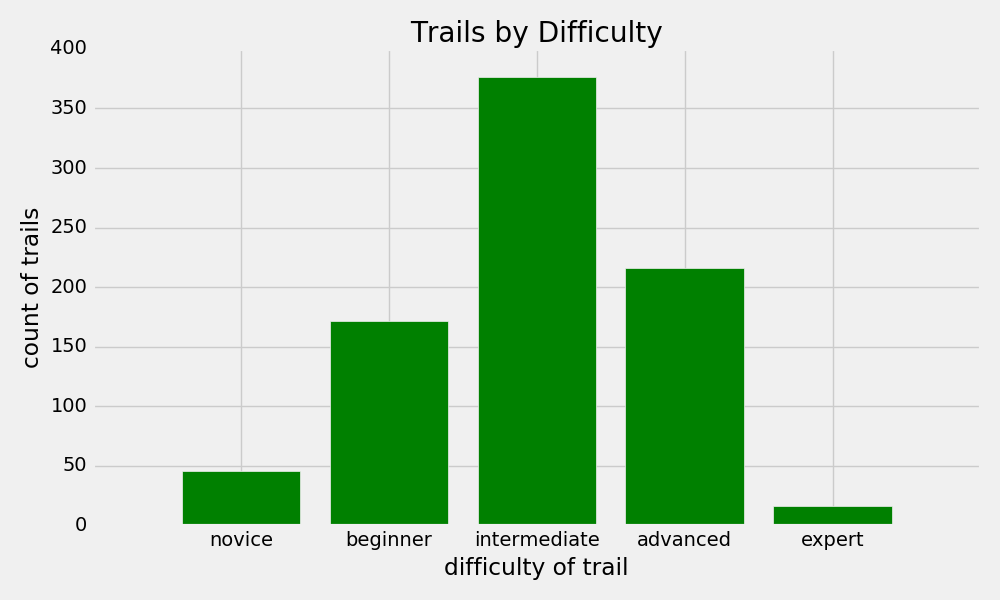
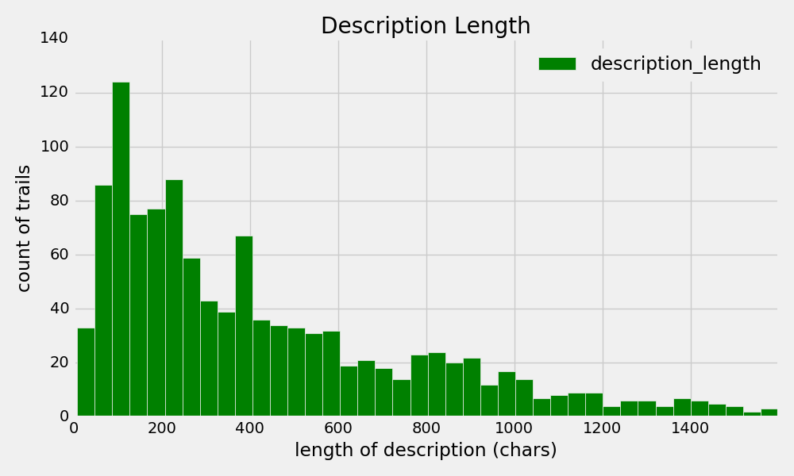

# Show Me Where to Shred: MTB Trail Recommender

I love mountain biking.  I love riding a fast, smooth, flowy trail with great berms and a few technical sections, and when I find a trail like that I think, "Where can I find more trails like this one?!"  If only there was a way to use the trail descriptions along with additional trail attributes, found on popular mountain biking trail apps/sites, to help riders find trails similar to their favorite(s)!

The goal of this project was to build a recommender using trail descriptions and characteristics, to recommend trails similar to a rider’s favorite(s).  There were two main components of this project:

1. **Description Topics:** Using Natural Language Processing (NLP), analyze the trail descriptions to uncover “topics” describing the trails.  I.e., find if there are underlying trail attributes like flowy, technical, scenic, etc. that show up in the description text, that can be used to describe and group trails.
2. **Trail Recommender:** Build a content-based recommender using the description topics from above, along with additional trail features (length, difficulty, star rating, etc.), to find trails most similar to a rider's favorites.  The last step was to productize the recommender in a Flask web app.

     

  
## Data

The website <a href="https://www.singletracks.com">singletracks.com</a> has mountain biking trail information on thousands of trails in the U.S.  The trail data is available through their API, and includes the trail name, location, difficulty, star rating, length in miles, and a short summary description of the trail.  I had also considered using trail data from mtbproject.com, another similar mountain biking trail website that I use often, but the trail descriptions provided through their API were very short (the average description length was 56 characters), and so did not provide sufficient data for robust natural language processing.

 
  
For the recommender, I chose to use data on trails in the Colorado area.  I used the API to get data for 1200 trails in Colorado and the surrounding area.  The API returns json with the following format:

To explore and model the data, I converted the json data into a pandas dataframe, and added several columns for 'length of description', 'distance to Denver', and several others not shown.

 

## EDA

To begin with, I performed some initial EDA, to get a sense of the trail data and features.
A few observations on the general features:

A look at the distribution of difficulty ratings shows that the largest portion of trails are intermediate.  

  
  
 
The majority of trails are under 10 miles long, but there are a number of longer trails including the longest trail at 140 miles (not shown on chart).

 
 

 

 
Taking a look at the number of characters in each description, we see that there is a wide range, from under 40 characters to over 1400.
 
 

 

Since I'm interested in the words in the descriptions, a general word cloud shows the most frequent words (with general stopwords removed, but before removing the 'mountain bike specific' stopwords I used for the topic modeling.)
 
 

 

## Uncovering Topics in Trail Descriptions with NLP

The first part of the project involved the trail description text, using Natural Language Processing and soft clustering methods to uncover latent topics that are used to describe the trails and surrounding areas.  As you can see above, each trail description is a short paragraph describing the trail.  It may include what to expect while riding, types of obstacles, directions to follow as you ride the trail, tips, scenery in the area, other activities, and general information about the trail/ride/area.

#### Processing & Featurization:

First, I removed trails where the description had fewer than 40 characters since they didn't have much information (blank description or very short, e.g., "Epic ride").  This left me with 1188 trails out of the original 1200.  Next, I created a custom class and methods to featurize my descriptions.  After trying various combinations of stopwords, n-grams, and lemmatization/stemming methods, I found that the following seemed to work the best on my dataset to generate meaningful tokens for successful topic modeling.  The general process is:
- Tokenize sentences into words (removing punctuation and converting to lowercase)
- Remove the first set of stopwords, that are not be included in the bigrams and trigrams creation.  I used a modified version of the gensim STOPWORDS that took out qualifier words like 'not', 'very', 'too', 'few' that may be useful for the bigrams/trigrams (e.g., want to keep phrases like "not too steep").
- Create bigrams and trigrams using gensim Phrases and Phraser
- Lemmatize using nltk WordNetLemmatizer and nltk's part-of-speech tagging.
- Remove the second set of stopwords, including 80+ domain-specific words and bigram/trigram phrases to remove (e.g., 'parking_lot', 'mountain_bike').  
 

 

#### Topic Modeling

With the processed tokens I used a "bag of words" approach, creating Term Frequency (TF) and Term Frequency-Inverse Document Frequency (TF-IDF) matrices for the various models. I tried several different clustering models to uncover topics, including Latent Dirichlet Allocation (LDA), Principal Component Analysis (PCA)
and Non-negative matrix factorization (NMF), varying the number of topics and other hyperparameters with each.  I assessed model scores such as Perplexity (for LDA) and Reconstruction Error (for NMF), but since the goal of this step in the project was to produce human-understandable topics describing trails, I ultimatley used my judgement of the resulting topics to pick the "best" model.  Also, I plotted reconstruction error against a varying number of topics between two and thirty, but this showed a nearly perfect inverse linear relationship -- the more topics used, the smaller the error but there was no obvious "elbow", so I didn't find this very useful.

The featurization and model that I found to produce the best set of topics (subjectively), was using NMF in sklearn with 10 topics on a TF-IDF matrix, using all stopwords including biking-specific words, no lemmatization, and bigrams.  Colleagues agreed that these topics "made sense" for describing mountain biking trails.

The diagram below shows those 10 topics; the word in each large center circle is the "top word" for that topic (i.e., word with the highest loading on that topic), and the surrounding words round out the top words for the topic.  To me, this seems like a nice set of topics; there is a "technical" topic that seems to describe the ride itself with words like "steep", "rocky", "climbs"; a "lake" topic describing other attributes of the area with "scenic", "forest", "meadows"; and a "fs" topic (stands for Forest Service) that seems to describe other types of activities beyond biking with words like "summer", "hiking", and "horseback".

 

 

These are the 10 topics that I used in the recommender. In this way, each trail description is represented by 10 variables ranging from 0 to 1 that convey how much of each topic is represented in that trail description.  So now we can compare similarity of trails not just by their numerical and categorical characteristics, but also by how similar their descriptions are.

## Trail Recommender

Using the trail description topics above along with additional trail data such as length, difficutly, rating, etc., I built a content-based trail recommender.  Content-based means that the recommender finds trails most similar to a user-selected trail based on characteristics of the trail itself, vs. a collaborative recommender that assesses similarity based on what other users have liked.  I then built the recommender into a web app using Flask and a Bootstrap template, and temporarily hosted it on an AWS EC2 instance (no longer running due to cost constraints).  To use the recommender app, a user selects a trail or set of trails that they enjoy riding, optionally selects a maximum distance from Denver for their recommendations, and then receives a list of recommendations, i.e., trails that are most similar to their selections.

 

 

#### Feature Selection, Scaling & Weighting

I used the following trail attributes as my features for the recommender:
- 10 trail description topics
- Length of trail (miles)
- Difficulty (novice, beginner, intermediate, advanced, expert)
- Average Star Rating (0 to 5 stars)
- Distance from Denver based on lat/lon (miles)
- Lift Service? (Y/N)
- Pump Track? (Y/N)

I chose to use the length of the trail/ride and difficulty since these convey important aspects of what a rider may want in a trail, to find similar trails.  Average user star rating is a bit unintuitive -- no one wants to ride poorly rated trails -- but if we assume that people will usually select trails with higher ratings as their favorites, then using star rating in the recommender will return other highly rated trails.

Distance from Denver is an optional filtering criteria in the app, but is also used in the recommender since trails in a given area are usually similar to one another, and a rider may want recommendations near where they already ride.  In future work however, distance from Denver could be omitted from the recommender features to give more geographically diverse recommendations.

Lastly, in addition to Lift Service and Pump Track (Y/N), Singletracks.com provides information on additional trail "features" such as whether there is Night Riding, Parking Fee, Restrooms, etc.  However, the availability of restrooms or a parking fee doesn't tell you much about the trail itself or what it's like to ride it.  Having Lift Service or a Pump Track, on the other hand, does tell you a lot about the ride.  Lift service is only available at bike resorts like Vail or Keystone, and pump tracks are usually only found in bike parks like Valmont Bike Park or Ruby Hill Park.  So I chose to include these two features in my recommender and omit the others.

I scaled all of the features for the recommender on a 0 to 1 scale.  Since the minimum of each feature was 0, and most were not normally distributed, I simply divided each value by the maximum of that feature rather than use a standard normalization.  The only exception to this was for Length of trail, where I used 30 miles as the maximum since the vast majority of trails are under 30 miles, but there are a few as long as 140 miles that would skew the rest of the data.

Lastly, I looked at weighting the features in the recommender.  I considered the relative subjective importance of each feature in a recommender, and obtained input from colleagues.  Ultimately, it seemed that each feature had about equal importance, and we seemed to be getting "good" recommendations using equal weights, so I kept equal weightings across all features.

I used cosine similarity as my distance metric to compare trail vectors.  My recommender can take a single trail as a feature vector and return the top n most similar trails as recommendations, or it can take a set of multiple trails and sum their feature vectors to return the top n most similar trails to the set of trails.  This way, a rider can get novel recommendations similar to the overall characteristics of all of the trails they like to ride (which is analogous to a user profile).

#### Developing a Web App

For the final part of this project, I implemented my recommender in a web app using Flask and Bootstrap, and briefly deployed it on AWS EC2 (currently the app is only running locally on my machine).  I was able to share my trail recommender app with colleagues, and demo it at our capstone project showcase -- it was well received, and multiple people commented that they thought the recommendations were useful!  

All of the files to run the web app, along with a Docker file and requirements.txt to build and a run a Docker container to run the app, can be found in the 'web_app' folder in this repo.

The following screenshots from the web app show how the recommender works.

 

To get recommendations based on one trail you like, you select a trail name from the drop-down of the ~1200 trails, and optionally select a maximum distance from Denver to filter the recommendations.

 

 

Clicking on the "Show Me Where to Shred" button then displays a summary of your top 5 recommendations, i.e., trails most similar to the one you selected.  You can click on a trail name to link to the trail page on Singletracks.com to get additional details.

 

Alternatively, you can choose multiple trails you enjoy, and get recommendations similar to a bunch of trails you like.

 

 

Overall, I'm satisfied with the recommendations.  As you would expect, the recommended trails are similar in difficulty, length, rating, region, and description to the selected trail.  For example, if you select Oil Well Flats, an intermediate, 15 mile singletrack trail system outside of Pueblo with an average rating of 4.31, the top three recommendations are Palmer Park, Red Rock Canyon, and Lion Canyon Loop -- all intermediate, 12-15 mile singletrack rides near Pueblo with similar features, scenery, and 3.5 to 4.22 average ratings.  The description for Red Rock Canyon even says "The ride is very similar to Palmer Park".

As another example, the recommendations similar to Trestle Bike Park (Winter Park's summer mountain biking park) are Keystone Resort Bike Park, Beaver Creek Ski Resort Bike Park, Vail Mountain Bike Park, Granby Ranch Bike Park, and Snowmass Bike Park.

## Future Work

There are several ways that the trail recommender could be enhanced, with the incorporation of additional data:

1. Include trails in regions beyond Colorado, to include the rest of the U.S. (and perhaps internationally)
2. Include additional trail data such as ascent/descent (vertical feet), which was not available through the Singletracks.com API.  This could be obtained either through webscraping the Singletracks.com website, and/or through the API of another popular mountain biking website, mtbproject.com, that provides this data.  The magnitude of a trail's ascent conveys how much climbing a rider has to do, and the descent is how much downhill a rider gets to enjoy, which are salient features in any ride.  Also, the ascent/descent compared to the total length of trail provides information on the trail's steepness, which is another important aspect of difficulty.  Incorporating this information into the recommender would enhance the recommendations to provide trails with similar climbing / descending / steepness.
3. It would also be interesting to compare the results of this content-based recommender to results from a collaborative recommender that recommends trails that other similar users have liked.  The API for mtbproject.com can also provide "user favorites" data -- a list of trails that a given user has "favorited".  With a sufficient number of users and user favorites, a collaborative recommendation system could be built.

